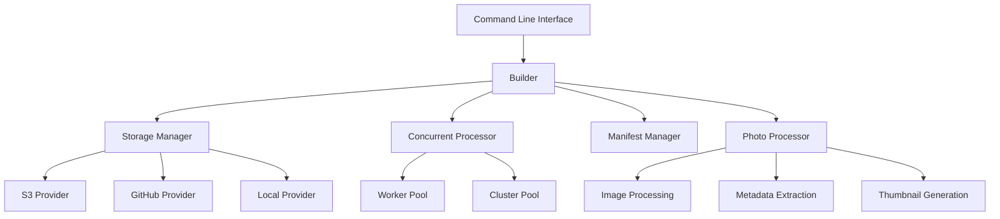

import { Callout } from 'fumadocs-ui/components/callout';

## Core Features

### 📸 Photo Processing
- **Format Conversion**: Support for HEIC to JPEG conversion
- **Thumbnail Generation**: Automatic generation of multiple size thumbnails
- **Metadata Extraction**: Complete EXIF data extraction and processing
- **Live Photo Detection**: Automatic detection and pairing of Live Photos
- **HDR Recognition**: Identification of HDR photos and multi-frame composite images

### 🎨 Image Analysis
- **ThumbHash Generation**: Generate compact placeholder hashes for each photo
- **Tone Analysis**: Automatic analysis of photo tone characteristics (high-key, low-key, normal, high-contrast)
- **Histogram Calculation**: Generate compressed color histogram data
- **Camera Recipe Extraction**: Support for Fujifilm and Sony camera shooting recipe recognition

### 🗄️ Storage Support
- **Amazon S3**: Support for standard S3 and compatible object storage
- **GitHub**: Use GitHub repositories as storage backend
- **Local Storage**: Support for local filesystem storage

### ⚡ Performance Optimization
- **Multi-process Processing**: Support for cluster mode multi-process concurrency
- **Thread Pool**: Worker-based concurrent processing
- **Incremental Updates**: Smart change detection to avoid duplicate processing
- **Caching Mechanism**: Smart caching of thumbnails and processing results

## Architecture Design

Builder adopts a layered architecture design with clear responsibilities for each module:



### Core Modules

| Module | Function | Location |
|--------|----------|----------|
| **Builder** | Build process orchestration | `src/builder/` |
| **Storage** | Storage abstraction layer | `src/storage/` |
| **Photo** | Photo processing | `src/photo/` |
| **Image** | Image processing | `src/image/` |
| **Worker** | Concurrency control | `src/worker/` |
| **Manifest** | Manifest management | `src/manifest/` |
| **Logger** | Logging system | `src/logger/` |

## Use Cases

### 1. Photo Library Building
Automatically scan photos in storage and generate complete index manifests:

```bash
# Incremental update
pnpm run cli

# Force reprocess all photos
pnpm run cli --force

# Only regenerate thumbnails
pnpm run cli --force-thumbnails
```

### 2. Batch Photo Processing
When processing large volumes of photos, Builder can:
- Automatically detect new photos
- Improve efficiency through concurrent processing
- Generate unified metadata formats
- Create multi-size thumbnails

### 3. Storage Migration
Support switching between different storage backends:
- Migrate from S3 to GitHub
- Local development environment configuration
- Multi-cloud storage strategies

## Key Features

<Callout type="info">
**High-Performance Processing**: Supports multi-process cluster mode, fully utilizing multi-core CPU advantages. Processing 1000 photos on an 8-core CPU can achieve 5-8x speed improvement compared to single-threaded processing.
</Callout>

<Callout type="info">
**Smart Incremental Updates**: Through file modification time and ETag comparison, only processes changed photos, significantly reducing duplicate computations.
</Callout>

<Callout type="info">
**Fujifilm Recipe Support**: Complete support for Fujifilm camera film simulation recipe extraction, including film mode, grain effects, color settings, and 15+ parameters.
</Callout>

<Callout type="info">
**Live Photo Support**: Automatically detects and pairs iPhone Live Photos, supporting HEIC+MOV format association processing.
</Callout>

## Configuration Example

Builder is configured through `builder.config.ts`:

```typescript
export default {
  storage: {
    provider: 's3',
    bucket: 'my-photos',
    region: 'us-west-2',
    customDomain: 'https://photos.example.com'
  },
  performance: {
    worker: {
      useClusterMode: true,
      workerCount: 8,
      workerConcurrency: 2
    }
  },
  options: {
    enableLivePhotoDetection: true,
    defaultConcurrency: 10
  }
}
```

## Output Format

The photo manifest generated by Builder (`photos-manifest.json`) contains rich metadata:

```json
{
  "version": "v5",
  "data": [
    {
      "id": "IMG_1234",
      "originalUrl": "https://example.com/IMG_1234.jpg",
      "thumbnailUrl": "https://example.com/thumbnails/IMG_1234.webp",
      "thumbHash": "1QcSHQRnh493V4dIh4eXh1h4kJUI",
      "width": 4032,
      "height": 3024,
      "aspectRatio": 1.33,
      "dateTaken": "2024-03-15T10:30:00.000Z",
      "exif": {
        "Make": "FUJIFILM",
        "Model": "X-T5",
        "FocalLength": "35mm",
        "FujiRecipe": {
          "FilmMode": "Classic Chrome",
          "DynamicRange": "Wide"
        }
      },
      "toneAnalysis": {
        "toneType": "normal",
        "brightness": 45,
        "contrast": 68
      },
      "isLivePhoto": true,
      "livePhotoVideoUrl": "https://example.com/IMG_1234.mov"
    }
  ]
}
```

The next section will detail how to configure and use Builder.
