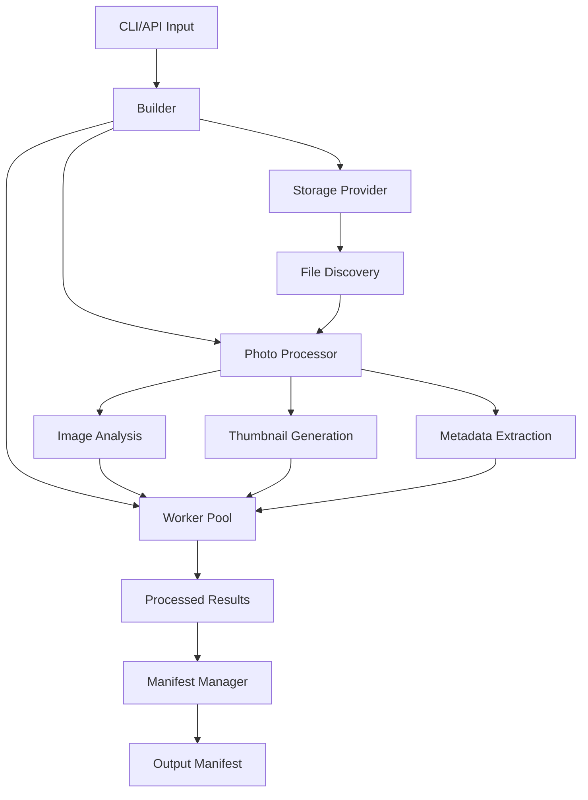

import { Callout } from '@/src/components/markdown/Callout';

## Development Setup

### Prerequisites

- Node.js 18+ 
- pnpm 8+
- Git
- ImageMagick (for image processing)
- Sharp (automatically installed)

### Environment Setup

```bash
# Clone the repository
git clone https://github.com/MaxtuneLee/Afilmory.git
cd Afilmory

# Install dependencies
pnpm install

# Navigate to builder package
cd packages/builder

# Install package-specific dependencies
pnpm install

# Build the package
pnpm build

# Run tests
pnpm test
```

### Development Scripts

```bash
# Development build with watch mode
pnpm dev

# Run tests with coverage
pnpm test:coverage

# Run tests in watch mode
pnpm test:watch

# Lint code
pnpm lint

# Format code
pnpm format

# Type checking
pnpm type-check

# Build for production
pnpm build
```

## Project Structure

```
packages/builder/
├── src/
│   ├── builder/          # Core builder logic
│   ├── storage/          # Storage provider implementations
│   ├── photo/            # Photo processing logic
│   ├── image/            # Image analysis and manipulation
│   ├── worker/           # Worker and cluster management
│   ├── manifest/         # Manifest generation and management
│   ├── logger/           # Logging utilities
│   ├── utils/            # Utility functions
│   ├── types/            # TypeScript type definitions
│   └── index.ts          # Main entry point
├── tests/                # Test files
├── docs/                 # Documentation
├── examples/             # Example configurations
└── scripts/              # Build and utility scripts
```

## Architecture Overview

### Core Components

#### 1. Builder Core (`src/builder/`)

The main orchestration layer that coordinates all operations:

```typescript
// src/builder/index.ts
export class Builder {
  private storage: StorageProvider;
  private processor: PhotoProcessor;
  private manifest: ManifestManager;
  private logger: Logger;

  async build(options: BuildOptions): Promise<BuildResult> {
    // Implementation
  }
}
```

Key responsibilities:
- Orchestrating the build process
- Managing configuration
- Coordinating between modules
- Error handling and reporting

#### 2. Storage Layer (`src/storage/`)

Abstraction layer for different storage backends:

```typescript
// src/storage/base.ts
export abstract class StorageProvider {
  abstract upload(path: string, data: Buffer): Promise<string>;
  abstract download(path: string): Promise<Buffer>;
  abstract exists(path: string): Promise<boolean>;
  // ... other methods
}
```

Implementations:
- `S3Provider` - Amazon S3 and compatible services
- `GitHubProvider` - GitHub repository storage
- `LocalProvider` - Local filesystem storage

#### 3. Photo Processing (`src/photo/`)

Core photo processing functionality:

```typescript
// src/photo/processor.ts
export class PhotoProcessor {
  async processPhoto(file: PhotoFile): Promise<ProcessedPhoto> {
    const metadata = await this.extractMetadata(file);
    const thumbnails = await this.generateThumbnails(file);
    const analysis = await this.analyzeImage(file);
    
    return {
      id: this.generateId(file),
      metadata,
      thumbnails,
      analysis
    };
  }
}
```

#### 4. Image Analysis (`src/image/`)

Advanced image analysis capabilities:

```typescript
// src/image/analysis.ts
export class ImageAnalyzer {
  async analyzeTone(buffer: Buffer): Promise<ToneAnalysis> {
    // Tone analysis implementation
  }

  async generateThumbHash(buffer: Buffer): Promise<string> {
    // ThumbHash generation
  }

  async generateHistogram(buffer: Buffer): Promise<number[]> {
    // Histogram generation
  }
}
```

#### 5. Worker Management (`src/worker/`)

Concurrent processing management:

```typescript
// src/worker/cluster.ts
export class ClusterPool {
  private workers: Worker[];

  async process<T>(tasks: Task[], options: ProcessOptions): Promise<T[]> {
    // Distribute tasks across workers
  }
}
```

### Data Flow



## Development Workflows

### Adding a New Storage Provider

1. **Create the provider class**:

```typescript
// src/storage/providers/custom.ts
import { StorageProvider } from '../base';

export class CustomProvider extends StorageProvider {
  constructor(private config: CustomConfig) {
    super();
  }

  async upload(path: string, data: Buffer): Promise<string> {
    // Implementation
  }

  // ... other required methods
}
```

2. **Add configuration types**:

```typescript
// src/types/config.ts
export interface CustomConfig {
  endpoint: string;
  apiKey: string;
  // ... other options
}

export type StorageConfig = S3Config | GitHubConfig | LocalConfig | CustomConfig;
```

3. **Register the provider**:

```typescript
// src/storage/factory.ts
export function createStorageProvider(config: StorageConfig): StorageProvider {
  switch (config.provider) {
    case 'custom':
      return new CustomProvider(config);
    // ... other cases
  }
}
```

4. **Add tests**:

```typescript
// tests/storage/custom.test.ts
describe('CustomProvider', () => {
  test('should upload files', async () => {
    const provider = new CustomProvider(mockConfig);
    const result = await provider.upload('test.jpg', buffer);
    expect(result).toBeDefined();
  });
});
```

### Adding Image Analysis Features

1. **Implement the analysis function**:

```typescript
// src/image/analyzers/custom-analyzer.ts
export async function analyzeCustomFeature(buffer: Buffer): Promise<CustomAnalysis> {
  // Implementation using Sharp, Canvas, or other image libraries
  const image = sharp(buffer);
  const metadata = await image.metadata();
  
  // Custom analysis logic
  return {
    feature: 'detected',
    confidence: 0.95
  };
}
```

2. **Add to the main analyzer**:

```typescript
// src/image/analyzer.ts
import { analyzeCustomFeature } from './analyzers/custom-analyzer';

export class ImageAnalyzer {
  async analyze(buffer: Buffer): Promise<ImageAnalysis> {
    const [tone, thumbHash, histogram, custom] = await Promise.all([
      this.analyzeTone(buffer),
      this.generateThumbHash(buffer),
      this.generateHistogram(buffer),
      analyzeCustomFeature(buffer)
    ]);

    return { tone, thumbHash, histogram, custom };
  }
}
```

3. **Update types**:

```typescript
// src/types/image.ts
export interface ImageAnalysis {
  tone: ToneAnalysis;
  thumbHash: string;
  histogram: number[];
  custom: CustomAnalysis;
}

export interface CustomAnalysis {
  feature: string;
  confidence: number;
}
```

### Performance Optimization

#### Profiling

```typescript
// Development utility for profiling
export class Profiler {
  private timers = new Map<string, number>();

  start(label: string) {
    this.timers.set(label, performance.now());
  }

  end(label: string): number {
    const start = this.timers.get(label);
    if (!start) throw new Error(`Timer ${label} not found`);
    
    const duration = performance.now() - start;
    console.log(`${label}: ${duration.toFixed(2)}ms`);
    return duration;
  }
}

// Usage
const profiler = new Profiler();
profiler.start('photo-processing');
await processPhoto(file);
profiler.end('photo-processing');
```

#### Memory Management

```typescript
// Utility for monitoring memory usage
export class MemoryMonitor {
  private baseline: NodeJS.MemoryUsage;

  constructor() {
    this.baseline = process.memoryUsage();
  }

  report(): void {
    const current = process.memoryUsage();
    const diff = {
      rss: current.rss - this.baseline.rss,
      heapUsed: current.heapUsed - this.baseline.heapUsed,
      external: current.external - this.baseline.external
    };

    console.log('Memory usage change:', {
      rss: `${(diff.rss / 1024 / 1024).toFixed(2)}MB`,
      heapUsed: `${(diff.heapUsed / 1024 / 1024).toFixed(2)}MB`,
      external: `${(diff.external / 1024 / 1024).toFixed(2)}MB`
    });
  }
}
```

## Testing

### Test Structure

```
tests/
├── unit/                 # Unit tests
│   ├── storage/
│   ├── photo/
│   ├── image/
│   └── utils/
├── integration/          # Integration tests
│   ├── build/
│   └── storage/
├── e2e/                  # End-to-end tests
├── fixtures/             # Test data
│   ├── images/
│   └── configs/
└── helpers/              # Test utilities
```

### Testing Utilities

```typescript
// tests/helpers/test-utils.ts
export class TestHelpers {
  static async createTestImage(width = 100, height = 100): Promise<Buffer> {
    return sharp({
      create: {
        width,
        height,
        channels: 3,
        background: { r: 255, g: 0, b: 0 }
      }
    })
    .jpeg()
    .toBuffer();
  }

  static createMockConfig(): BuilderConfig {
    return {
      storage: {
        provider: 'local',
        basePath: './test-photos',
        baseUrl: 'http://localhost:3000'
      }
    };
  }

  static async withTempDir<T>(fn: (dir: string) => Promise<T>): Promise<T> {
    const dir = await fs.mkdtemp(path.join(os.tmpdir(), 'builder-test-'));
    try {
      return await fn(dir);
    } finally {
      await fs.rm(dir, { recursive: true, force: true });
    }
  }
}
```

### Example Tests

```typescript
// tests/unit/photo/processor.test.ts
describe('PhotoProcessor', () => {
  let processor: PhotoProcessor;
  let testImage: Buffer;

  beforeEach(async () => {
    processor = new PhotoProcessor(TestHelpers.createMockConfig());
    testImage = await TestHelpers.createTestImage();
  });

  test('should process photo successfully', async () => {
    const result = await processor.processPhoto(testImage);
    
    expect(result.id).toBeDefined();
    expect(result.width).toBe(100);
    expect(result.height).toBe(100);
    expect(result.thumbnails).toHaveLength(3);
  });

  test('should extract EXIF data', async () => {
    const photo = await sharp(testImage)
      .withMetadata()
      .jpeg()
      .toBuffer();

    const result = await processor.processPhoto(photo);
    expect(result.exif).toBeDefined();
  });
});
```

## Debugging

### Logging

Builder uses a structured logging system:

```typescript
// src/logger/index.ts
export class Logger {
  debug(message: string, context?: object): void {
    if (process.env.NODE_ENV === 'development') {
      console.log(`[DEBUG] ${message}`, context);
    }
  }

  info(message: string, context?: object): void {
    console.log(`[INFO] ${message}`, context);
  }

  error(message: string, error?: Error, context?: object): void {
    console.error(`[ERROR] ${message}`, { error: error?.stack, ...context });
  }
}
```

### Debug Configuration

```typescript
// For development debugging
export default {
  storage: {
    provider: 'local',
    basePath: './debug-photos'
  },
  options: {
    includeDebugInfo: true,
    prettyPrintJson: true
  },
  logging: {
    level: 'debug',
    includeTimestamps: true,
    includePid: true
  }
}
```

## Contributing

### Code Style

We use ESLint and Prettier for code formatting:

```bash
# Check code style
pnpm lint

# Fix auto-fixable issues
pnpm lint:fix

# Format code
pnpm format
```

### Commit Guidelines

Follow conventional commits:

```
feat: add support for WebP thumbnail generation
fix: resolve memory leak in cluster mode
docs: update API reference for storage providers
test: add integration tests for GitHub provider
refactor: simplify photo processing pipeline
```

### Pull Request Process

1. Fork the repository
2. Create a feature branch
3. Make your changes
4. Add tests for new functionality
5. Update documentation
6. Submit a pull request

### Release Process

```bash
# Version bump
pnpm version patch|minor|major

# Build and test
pnpm build
pnpm test

# Publish to npm
pnpm publish
```

## Performance Benchmarks

### Running Benchmarks

```bash
# Run performance benchmarks
pnpm benchmark

# Specific benchmark
pnpm benchmark -- --grep "photo processing"

# With profiling
pnpm benchmark:profile
```

### Example Benchmark

```typescript
// benchmarks/photo-processing.ts
import { Benchmark } from './helpers';

const benchmark = new Benchmark('Photo Processing');

benchmark.add('Single photo processing', async () => {
  const processor = new PhotoProcessor(config);
  await processor.processPhoto(testImage);
});

benchmark.add('Batch photo processing', async () => {
  const builder = new Builder(config);
  await builder.build({ includePatterns: ['test-photos/*.jpg'] });
});

await benchmark.run();
```

<Callout type="info">
**Development Tip**: Use the development build (`pnpm dev`) for faster iteration during development. It includes source maps and additional debugging information.
</Callout>

<Callout type="warning">
**Testing Note**: Always test storage provider changes with actual cloud services in addition to mocked tests to ensure real-world compatibility.
</Callout>

This concludes the comprehensive Builder package documentation. The guides cover everything from basic usage to advanced development and contribution workflows.
